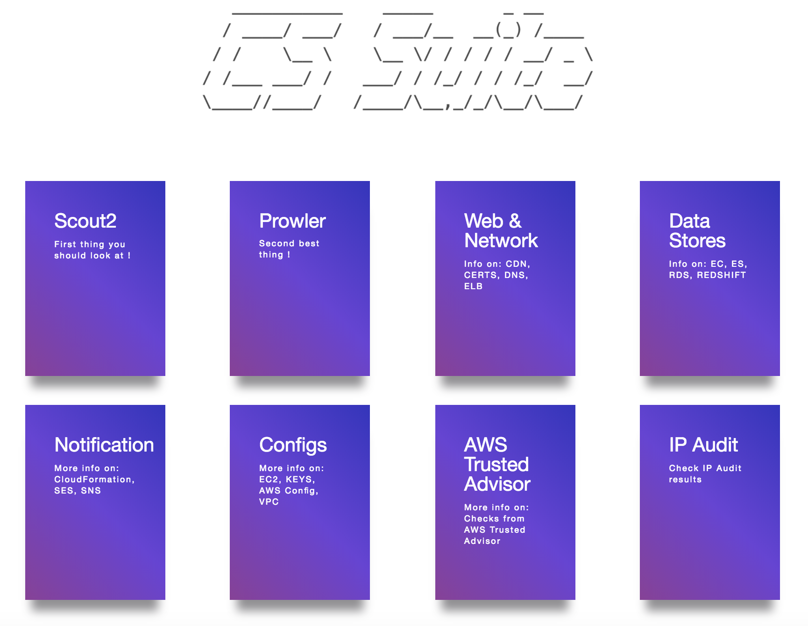

# Cloud Security Suite (cs-suite) - Version 3.0

## Usage
```
usage: cs.py [-h] -env {aws,gcp,azure,digitalocean} -aip AUDIT_IP -u USER_NAME -pem
             PEM_FILE [-p] [-pId PROJECT_ID] [-az_u AZURE_USER]
             [-az_p AZURE_PASS] [-o OUTPUT] [-w] [-n NUMBER]

this is to get IP address for lynis audit only

optional arguments:
  -h, --help            show this help message and exit
  -env {aws,gcp,azure,digitalocean}, --environment {aws,gcp,azure,digitalocean}
                        The cloud on which the test-suite is to be run
  -aip AUDIT_IP, --audit_ip AUDIT_IP
                        The IP for which lynis Audit needs to be done .... by
                        default tries root/Administrator if username not
                        provided
  -u USER_NAME, --user_name USER_NAME
                        The username of the user to be logged in,for a
                        specific user
  -pem PEM_FILE, --pem_file PEM_FILE
                        The pem file to access to AWS instance
  -p, --password        hidden password prompt
  -pId PROJECT_ID, --project_id PROJECT_ID
                        Project ID for which GCP Audit needs to be run. Can be
                        retrivied using `gcloud projects list`
  -az_u AZURE_USER, --azure_user AZURE_USER
                        username of azure account, optionally used if you want
                        to run the azure audit with no user interaction.
  -az_p AZURE_PASS, --azure_pass AZURE_PASS
                        username of azure password, optionally used if you
                        want to run the azure audit with no user interaction.
  -o OUTPUT, --output OUTPUT
                        writes a log in JSON of an audit, ideal for
                        consumptions into SIEMS like ELK and Splunk. Defaults
                        to cs-audit.log
  -w, --wipe            rm -rf reports/ folder before executing an audit
  -n, --number          Retain number of report to store for a particular 
                        environment and user/project.
```
## Requirements
* Operating System **OSX** or **Linux** only
* python 2.7
* pip
* git
* jq
* gcc (for sshpass installation (OS Audit). Not a mandatory pre-requisite)
* AWS Audit - AWS ReadOnly Keys
* GCP Audit - gcloud setup
* Azure Audit - Azure user read-only access
* DigitalOcean Audit - DigitalOcean API key and SPACES access_key and access_secret

## Installation
(in order to avoid missing with the already installed python libraries)

 - get project `git clone https://github.com/SecurityFTW/cs-suite.git &&
cd cs-suite/`   
 - install [virtualenv](https://virtualenv.pypa.io/en/latest/) `pip install virtualenv`
 - create a python 2.7 local enviroment `virtualenv -p python2.7 venv`  
 - activate the virtual enviroment `source venv/bin/activate` 
 - install project dependencies `pip install -r requirements.txt`
 - run the tool via `python cs.py --help`

### AWS Configuration
- In AWS create a IAM user with at least the following policy `arn:aws:iam::aws:policy/ReadOnlyAccess` 
- In your local [install aws cli](https://docs.aws.amazon.com/cli/latest/userguide/cli-chap-install.html) `brew install awscli` _for OSX_  
- Configure AWS cli `aws configure`

### GCP Configuration
- create a [project](https://cloud.google.com/resource-manager/docs/creating-managing-projects) in GCP
- enable the [Cloud resource manager API](https://console.cloud.google.com/apis/api/cloudresourcemanager.googleapis.com/overview)
- create a [service account](https://cloud.google.com/iam/docs/creating-managing-service-account-keys#creating_service_account_keys), download its key JSON and place it under `cs-suite/tools/G-Scout/keyfile.json`)
- Install [google cloud sdk](https://cloud.google.com/sdk/install#installation_options)
- configure google clound sdk `gcloud init`  

### Azure Configuration

- signup and have logged in already to [azure.microsoft.com](https://azure.microsoft.com)
- install azure CLI `brew install az`
- authenticate the azure cli `az login`, you should see your subscription type if it was successful, simiarly to the response below:


```
[
  {
    "cloudName": "AzureCloud",
    "id": "xxxxx-5595-4da5-bc27-xxxeeee",
    "isDefault": true,
    "name": "Free Trial",
    "state": "Enabled",
    "tenantId": "xxxxx-18e9-41a4-961b-xxxxx",
    "user": {
      "name": "customer@email.com",
      "type": "user"
    }
  }
]
```

### DigitalOcean Configuration

- create Personal Access Tokens and Spaces Access keys [cloud.digitalocean.com](https://cloud.digitalocean.com/account/api/tokens)
- set the credentials by running export

export DO_KEY=*********************

export DO_ACCESS_KEY=*******************

export DO_SECRET_KEY=****************************


## Running cs-suite

```
To run AWS Audit - python cs.py -env aws
To run GCP Audit - python cs.py -env gcp -pId <project_name>
To run Azure Audit - python cs.py -env azure
To run DigitalOcean Audit - python cs.py -env digitalocean
```

- The final report will be available in `reports` directory

- The final AWS Audit report looks like below:



- The final GCP Audit report looks like below:


## Docker Setup

- Create a local directory `aws` with `credentials` and `config` files

- The `config` file looks like below

```
$ cat aws/config

[default]
output = json
region = us-east-1
```
- The `credentials` file looks like below

```
$ cat aws/credentials

[default]
aws_access_key_id = XXXXXXXXXXXXXXX
aws_secret_access_key = XXXXXXXXXXXXXXXXXXXXXXXXX
```

***Note: This tool requires `arn:aws:iam::aws:policy/ReadOnlyAccess` IAM policy***

- Then run the follwing docker command to start (passing your specific enviroment)

```
docker run -v `pwd`/aws:/root/.aws -v `pwd`/reports:/app/reports securityftw/cs-suite -env aws
```

## Documentation
[https://securityftw.github.io](https://securityftw.github.io)

## Thanks
* Scout2 - https://github.com/nccgroup/Scout2
* Prowler - https://github.com/Alfresco/prowler
* Lunar - https://github.com/lateralblast/lunar
* Lynis - https://github.com/CISOfy/lynis
* G-Scout - https://github.com/nccgroup/G-Scout
* @alanrenouf - https://github.com/alanrenouf/Windows-Workstation-and-Server-Audit
* Ranjeet Sengar - https://github.com/sengar23
